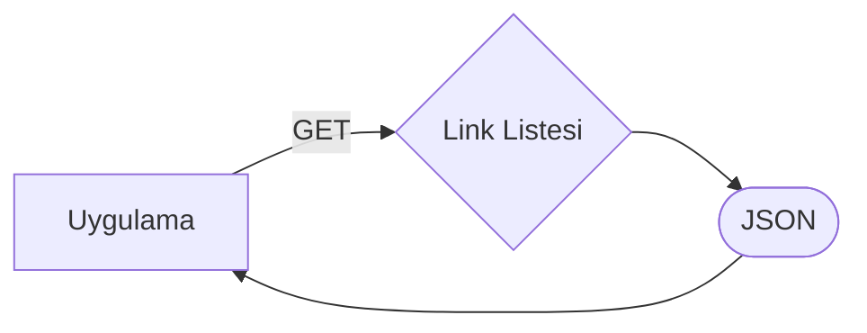
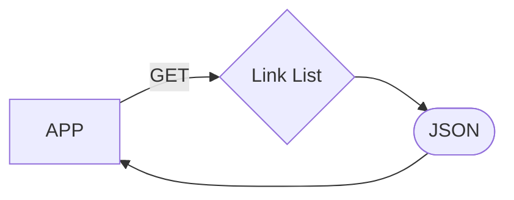

# PHP Sitemap Oluşturucu

Bu uygulamayla PHP kullanarak dinamik bir sitemap oluşturabilirsiniz.

## Çalışma Mantığı

# PHP Sitemap Generator

With this application you can create a dynamic sitemap using PHP.

## Working logic

